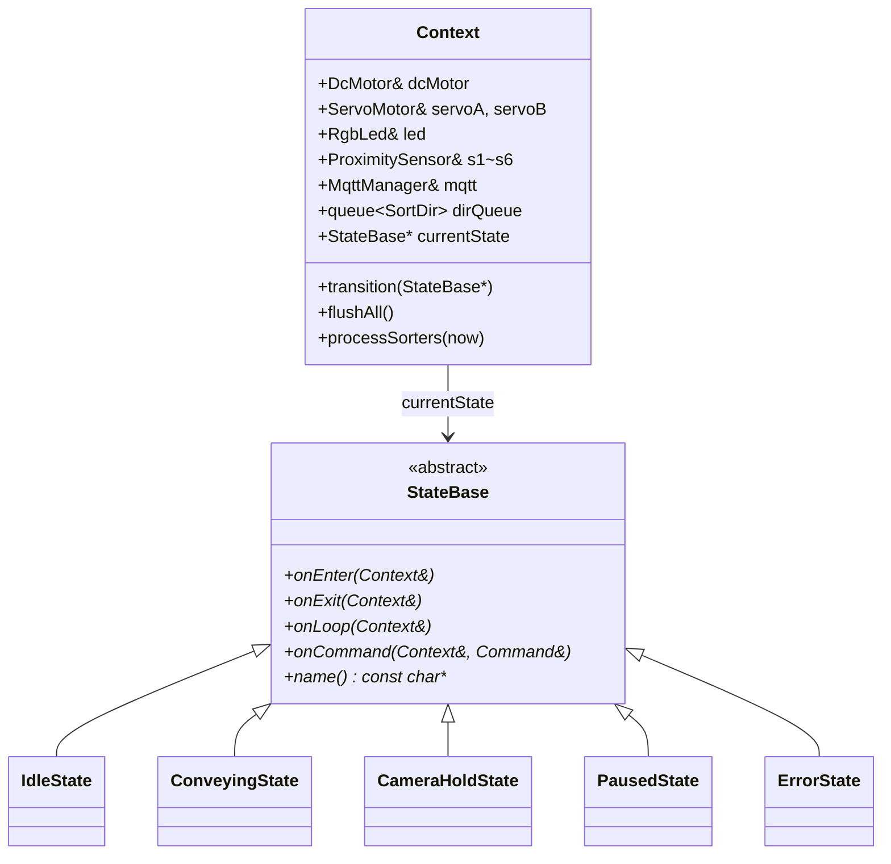
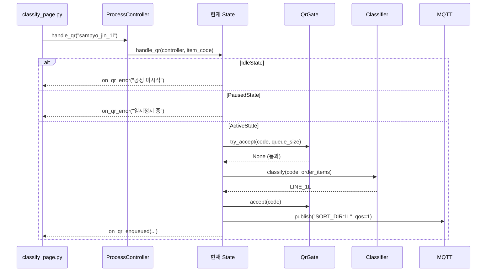
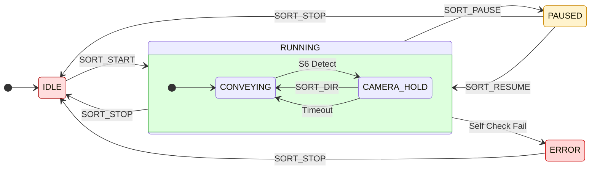
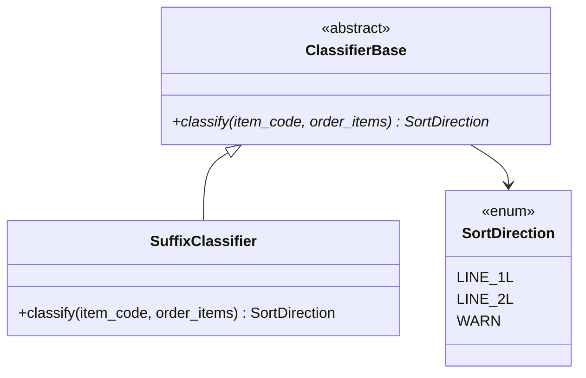

# HFSM & State 디자인패턴 적용 종합 보고서

> 📅 2026-03-06 | IoT 컨베이어 벨트 분류 시스템 (Soy-Factory)

---

## 목차

1. [변경 동기 및 요구사항](#1-변경-동기-및-요구사항)
2. [아키텍처 개요](#2-아키텍처-개요)
3. [ESP32-DevKit 아키텍처](#3-esp32-devkit-아키텍처)
4. [soy-pc 아키텍처](#4-soy-pc-아키텍처)
5. [HFSM 상태 전이 설계](#5-hfsm-상태-전이-설계)
6. [QR 3단 필터 설계](#6-qr-3단-필터-설계)
7. [카메라 스트리밍 및 QR 디코딩 최적화](#7-카메라-스트리밍-및-qr-디코딩-최적화)
8. [분류기 독립화 (Strategy Pattern)](#8-분류기-독립화-strategy-pattern)
9. [MQTT QoS 정책](#9-mqtt-qos-정책)
10. [분류 대기 정리 메커니즘](#10-분류-대기-정리-메커니즘)
11. [CleanShutdown 프로토콜](#11-cleanshutdown-프로토콜)
12. [ESP32 메모리 분석](#12-esp32-메모리-분석)
13. [전체 변경 파일 목록](#13-전체-변경-파일-목록)
14. [빌드 및 실행 방법](#14-빌드-및-실행-방법)

---

## 1. 변경 동기 및 요구사항

### 기존 문제점

| 문제 | 설명 |
|------|------|
| 플랫 FSM | ESP32의 `RUNNING` 상태 내부에서 전역 플래그(`_cameraWaitingForDir`, `_servoASorting` 등)로 서브상태를 관리 → 상태 누락 및 오동작 위험 |
| QR 중복 인식 | 컨베이어 정지 상태에서 카메라 아래 상품이 계속 촬영되면 동일 QR이 반복 등록 |
| 분류기 FSM 종속 | 분류 결정 로직이 ProcessController 내부에 하드코딩 → 규칙 변경이 어려움 |
| 종료 잔류 데이터 | 프로그램 강제 종료 시 큐/상태가 남아 재실행 시 오동작 |
| 분류 대기 잔류 | 서보 타임아웃 후 미분류로 빠져도 GUI에 '분류중' 표시가 잔류 |

### 5대 요구사항

1. **QR 최소 대기시간** — 인식 간 1.5초 쿨다운
2. **프로젝트 계획 기반 분리** — 플랫 구조에서 벗어나 5개 상태(IDLE, CONVEYING, CAMERA_HOLD, PAUSED, ERROR)로 간소화 및 분류기 동작을 백그라운드로 독립
3. **분류기 완전 독립성(PC/ESP32)** — soy-pc는 Classifier 클래스로 결정 책임을 분리하고, ESP32는 `Context::processSorters()`를 통해 FSM 상태와 무관하게 서보 제어를 독립적으로 처리
4. **QR 예외 처리 및 성능** — QR 3단 필터 적용, 카메라 렉을 방지하기 위한 UDP 스캔 프레임 제한 (최대 4FPS)
5. **CleanShutdown** — 종료 시 잔여 데이터 완전 정리

---

## 2. 아키텍처 개요

### 시스템 2-Tier 구조

```
┌──────────────────────────────────────────────────────────────┐
│                        soy-pc (Python)                        │
│                                                                │
│  ┌─────────────┐  ┌────────────┐  ┌───────────┐               │
│  │ classify_page│  │ProcessCtrl │  │  states/  │               │
│  │   (GUI/UI)  │──│ (위임자)   │──│ idle.py   │               │
│  │             │  │            │  │ active.py │               │
│  └─────────────┘  │ QrGate     │  │ paused.py │               │
│                   │ Classifier │  └───────────┘               │
│                   └─────┬──────┘                               │
│                         │ MQTT (QoS 1)                        │
├─────────────────────────┼────────────────────────────────────┤
│                         │                                      │
│  ┌──────────────────────▼──────────────────────────────────┐   │
│  │                   ESP32-DevKit (C++)                      │   │
│  │                                                           │   │
│  │  ┌─────────┐    ┌───────────────────────────────────┐    │   │
│  │  │ Context │───│ State 패턴 (5개 상태 클래스)       │    │   │
│  │  │(공유데이터)│  │ idle / conveying / camera_hold    │    │   │
│  │  │         │   │ paused / error                     │    │   │
│  │  │ DC모터  │   └───────────────────────────────────┘    │   │
│  │  │ 서보A/B │    ┌───────────────────────────────────┐    │   │
│  │  │ 센서6개 │    │ Background Task (processSorters)  │    │   │
│  │  │ RGB LED │    │ 상태와 무관하게 분류 동작 독립 수행    │    │   │
│  │  └─────────┘    └───────────────────────────────────┘    │   │
│  └──────────────────────────────────────────────────────────┘   │
└──────────────────────────────────────────────────────────────┘
```

---

## 3. ESP32-DevKit 아키텍처

### 디렉토리 구조 (헤더/소스 분리)

```
soy-controller/esp32-devkit/
├── platformio.ini              build_flags: -Iinclude
│
├── include/                    ← 헤더 파일 (.h) — 19개
│   ├── config.h                   핀 매핑, 타이밍, MQTT 토픽
│   ├── command.h                  MQTT 명령 파싱 (CommandType enum)
│   ├── fsm.h                     State, SubState, SortDir enum
│   ├── esp/
│   │   └── config_mqtt.h         MQTT 공통 상수 (TOPIC_CONTROL, PORT)
│   ├── fsm/
│   │   ├── state_base.h          StateBase 추상 인터페이스
│   │   ├── context.h             Context 공유 구조체 (processSorters 선언)
│   │   ├── idle_state.h          IDLE 상태
│   │   ├── conveying_state.h     CONVEYING 서브스테이트
│   │   ├── camera_hold_state.h   CAMERA_HOLD 서브스테이트
│   │   ├── paused_state.h        PAUSED 상태
│   │   └── error_state.h         ERROR 상태
│   ├── motor/
│   │   ├── dc_motor.h            DC 모터 드라이버 (A4950)
│   │   └── servo_motor.h         서보 모터 드라이버 (MCPWM)
│   ├── peripheral/
│   │   ├── rgb_led.h             RGB LED + 점멸 기능
│   │   └── proximity_sensor.h    아날로그/디지털 근접 센서
│   └── net/
│       ├── wifi_manager.h        WiFi STA 연결
│       └── mqtt_manager.h        MQTT 래핑 (PubSubClient)
│
└── src/                        ← 소스 파일 (.cpp) — 16개
    ├── main.cpp                   setup() + loop() (Context + State 위임)
    ├── command.cpp                Command::parse() 구현
    ├── fsm/
    │   ├── context.cpp            transition(), flushAll(), processSorters()
    │   ├── idle_state.cpp         DC OFF, 서보 중립, 큐 flush
    │   ├── conveying_state.cpp    DC On, S6 감지 및 카메라 대기 상태 전이
    │   ├── camera_hold_state.cpp  DC 정지, QR 대기, 타임아웃
    │   ├── paused_state.cpp       DC 정지, 큐 보존 (서보는 자체 동작 허용)
    │   └── error_state.cpp        빨강 점멸, SORT_STOP만 수용
    ├── motor/
    │   ├── dc_motor.cpp           A4950 Slow Decay PWM
    │   └── servo_motor.cpp        MCPWM 서보 제어
    ├── peripheral/
    │   ├── rgb_led.cpp            LED 고정색 + updateBlink()
    │   └── proximity_sensor.cpp   ADC/Digital + 디바운스
    └── net/
        ├── wifi_manager.cpp       WiFi.begin() 블로킹 연결
        └── mqtt_manager.cpp       PubSubClient 래핑 + QoS 1 구독
```

### State 패턴 클래스 다이어그램



### main.cpp 핵심 구조

```cpp
// 상태 인스턴스 (정적 — 힙 할당 없음)
IdleState       idleState;
ConveyingState  conveyingState;
// ... 5개 상태

// Context (모든 상태가 공유)
static Context ctx { dcMotor, servoA, servoB, led, s1~s6, mqtt };

// MQTT 명령 → 현재 상태에 위임
static void onCommand(const Command& cmd) {
    ctx.currentState->onCommand(ctx, cmd);
}

void loop() {
    mqtt.loop();
    ctx.currentState->onLoop(ctx);  // ← 한 줄로 모든 로직 위임
}
```

---

## 4. soy-pc 아키텍처

### 디렉토리 구조

```
soy-pc/
├── main.py                         CleanShutdown (atexit/signal)
├── mqtt_client.py                  토픽별 QoS 정책 (device/control: QoS 1)
│
└── features/worker/
    ├── classifier.py            [NEW] 독립 분류기 (Strategy Pattern)
    ├── qr_gate.py               [NEW] QR 3단 필터
    ├── process_controller.py    [MOD] State 패턴 위임자
    ├── states/                  [NEW] State 패턴 디렉토리
    │   ├── __init__.py
    │   ├── base.py                 ProcessStateBase 인터페이스
    │   ├── idle.py                 IdleState — QR 거부, 센서 무시
    │   ├── active.py               ActiveState — QR 필터 + 분류 + 센서 전체
    │   └── paused.py               PausedState — QR 거부, 근접 센서만
    ├── classify_page.py            GUI (변경 없음)
    ├── threads.py                  UDP 카메라 + MQTT 브릿지
    ├── inbound_dialog.py           입고 다이얼로그
    └── screen.py                   화면 구성
```

### State 패턴 이벤트 위임 흐름



---

## 5. HFSM 상태 전이 설계

### 전체 상태 전이 다이어그램



### LED 색상 매핑

| 상태 | LED | 패턴 | 의미 |
|------|-----|------|------|
| IDLE | 🔴 빨강 | 고정 | 대기 중 |
| CONVEYING | 🟢 초록 | 고정 | 정상 이송 (분류기 백그라운드 동작 포함) |
| CAMERA_HOLD | 🟢 초록 | **점멸** (500ms) | QR 대기 중 |
| PAUSED | 🟡 노랑 | 고정 | 일시 정지 |
| ERROR | 🔴 빨강 | **점멸** (500ms) | 에러 발생 |

### 센서 매핑

| 센서 | GPIO | 역할 | 트리거 조건 |
|------|------|------|-------------|
| S1 | 34 (ADC) | 1L 분류위치 감지 | threshold ≥ 600 |
| S2 | 35 (ADC) | 2L 분류위치 감지 | threshold ≥ 600 |
| S3 | 32 (ADC) | 1L 통과 확인 | threshold ≥ 600 |
| S4 | 33 (ADC) | 2L 통과 확인 | threshold ≥ 600 |
| S5 | 36 (ADC) | 미분류 확인 | threshold ≥ 600 |
| S6 | 39 (Digital) | 카메라 위치 감지 | Active-Low, debounce 10ms |

---

## 6. QR 3단 필터 설계

### 필터 체인

```
QR 프레임 도착
  │
  ▼
① 최소 대기시간 (1.5초)        ← 마지막 등록 후 1.5초 미경과 → 거부
  │ 통과
  ▼
② 카메라 위치 게이트             ← CAMERA_DETECT 미수신 → 거부
  │ 통과                            (물리적으로 S6 앞에 상품이 없으면 열리지 않음)
  ▼
③ 동일 QR 연속 차단             ← 직전과 같은 item_code → 거부
  │ 통과
  ▼
④ 큐 크기 제한 (5개)            ← sort_queue ≥ 5 → 거부
  │ 통과
  ▼
✅ 통과 → Classifier.classify() → SORT_DIR 발행
```

### 중복 차단 시나리오

| 상황 | 필터 | 결과 |
|------|------|------|
| 컨베이어 정지 중 카메라 아래에 상품 | ② GATE_CLOSED | 거부 ✅ |
| 같은 상품이 0.5초 안에 재촬영 | ① COOLDOWN | 거부 ✅ |
| SORT_DIR 전송 후 같은 QR 재감지 | ③ DUPLICATE | 거부 ✅ |
| 대기열이 5개 이상 | ④ QUEUE_FULL | 거부 + UI 알림 |
| 공정 미시작 | ⓪ PROCESS_INACTIVE | 거부 + UI 알림 |

### QrGate 상태 변화 흐름

```
초기: gate_open=False, last_code=None, ts=0

ESP32 S6 감지 → CAMERA_DETECT 발행
  → gate_open=True, last_code=None (이전 코드 리셋)

QR "sampyo_jin_1l" 인식 → try_accept() 통과 → accept()
  → gate_open=False (다음 CAMERA_DETECT까지 닫힘)
  → last_code="sampyo_jin_1l"
  → ts=현재시각

같은 QR 재촬영 → try_accept():
  ② gate_open=False → GATE_CLOSED 거부 ✅
```

---

## 7. 카메라 스트리밍 및 QR 디코딩 최적화

### 실시간 영상 스트리밍과 QR 해독의 완전 분리
이전 구조에서는 UDP 영상 프레임 도달 시 `pyzbar` 영상 해독이 프레임 단위로 즉각 수행되어, QR 해독 연산(이미지 회전, 이진화 등 최대 약 0.5초 소요)이 원본 UDP 카메라 스트림 스레드를 블로킹(Blocking)하는 현상이 있었습니다. 이는 카메라가 객체를 감지(`CAMERA_DETECT`)하고 정지한 순간 극심한 영상 렉을 초래했습니다.

**해결 방안 (`QRDecodeWorker` 도입):**
* **UDP 카메라 스레드 (`UdpCameraThread`):** 순수하게 영상을 수신하여 최고 속도로 GUI로 렌더링하고, 가장 최신 프레임을 1칸짜리 비동기 큐(`Queue`)에 삽입합니다.
* **비동기 디코드 스레드 (`QRDecodeWorker`):** 큐에 가장 최근 도착한 영상 프레임을 꺼내 독립적으로 백그라운드 환경에서 해독합니다. 연산이 아무리 지연되어도 영상 수신 프레임레이트에는 어떠한 영향도 끼치지 않습니다.

### 메모리 병목 및 지연 최적화 포인트
* **메모리 복사 효율 향상:** JPEG 스트림 청크(`chunks`)들을 병합 시 파이썬 `+=` 연산자 대신 `b"".join()`을 이용하여 불필요한 메모리 재할당 및 복사 오버헤드를 완전히 제거하고 속도를 최적화했습니다.
* **과도한 버퍼 수신 지연(Latency) 원복:** 임시로 OS의 UDP 수신 버퍼(`SO_RCVBUF`)를 1MB로 크게 설정했으나, 파이썬 쪽에서 오래전 프레임을 쌓아두고 실시간성을 망치는 부작용이 있어 기존 설정으로 롤백하여 실시간(가장 최근 데이터 위주) 수신을 보장했습니다.

---

## 8. 분류기 독립화 (Strategy Pattern)



### 분류 규칙 (SuffixClassifier)

```python
def classify(item_code, order_items) -> SortDirection:
    # 1. 주문 품목에 존재하는지 확인
    if item_code not in order_items → WARN

    # 2. suffix로 방향 결정
    if item_code.endswith("_1l") → LINE_1L
    if item_code.endswith("_2l") → LINE_2L
    else → WARN
```

> 향후 분류 규칙 변경 시 `ClassifierBase`를 구현하는 새 클래스만 만들면 됩니다.
> FSM, MQTT, 센서 코드는 전혀 수정 불필요.

---

## 9. MQTT QoS 정책

### QoS 레벨 설명

| QoS | 이름 | 동작 | 사용 상황 |
|-----|------|------|-----------|
| **0** | 최선 전달 | 보내고 끝 (확인 없음) | 센서 데이터, 상태 업데이트 |
| **1** | 최소 1회 | 수신 확인(PUBACK)까지 재전송 | 분류 명령, 정지 명령 |
| **2** | 정확히 1회 | 4단계 핸드셰이크 | 미사용 (ESP32 미지원) |

### 토픽별 QoS 적용 현황

| 토픽 | 방향 | QoS | 근거 |
|------|------|-----|------|
| `device/control` | soy-pc → ESP32 | **1** | SORT_DIR, SORT_STOP 유실 방지 |
| `device/sensor` | ESP32 → soy-pc | 0 | PubSubClient 발행 제약 (QoS 0만 지원) |
| `device/status` | ESP32 → soy-pc | 0 | MQTT 재연결 시 상태 재발행으로 보완 |

### 구현 위치

```python
# soy-pc/mqtt_client.py
_TOPIC_QOS = {
    "device/control": 1,   # PC→ESP32: QoS 1 (at-least-once)
}
_DEFAULT_QOS = 0             # 기본: QoS 0

def publish(self, topic, payload):
    qos = _TOPIC_QOS.get(topic, _DEFAULT_QOS)
    c.publish(topic, payload, qos=qos)
```

```cpp
// ESP32 net/mqtt_manager.cpp
_mqtt.subscribe(config::mqtt::TOPIC_CONTROL, 1);  // QoS 1 구독
```

---

## 10. 분류 대기 정리 메커니즘

### 문제 시나리오 (수정 전)

```
1. QR "sampyo_jin_1l" 인식 → pending: [("sampyo_jin_1l", "1L")]
2. ESP32 SORTING_1L 발행 → station_1l_active = True
3. ★ 서보A safety timeout (2초) → servoA.center(), CONVEYING 복귀
   → soy-pc에 이벤트 발행 없음!
4. 상품이 S5 도달 → SORTED_UNCLASSIFIED 발행
5. soy-pc: pending 비워짐 BUT station_1l_active = True ← ❌ GUI '1L 분류중' 잔류!
```

### 수정 후 동작

```python
# states/active.py — SORTED_UNCLASSIFIED 처리
elif event == SensorEvent.SORTED_UNCLASSIFIED:
    removed_dir = pending_items.pop(0)  # 첫 항목 제거, 방향 기록

    # ★ 해당 방향의 station 플래그 정리
    if removed_dir == "1L" and station_1l_active:
        if no_more_1l_in_pending:
            station_1l_active = False     # ← 정리!
            on_sorting_ended("1L")

    # ★ 컨베이어 완전 비어있으면 전체 초기화
    _cleanup_if_empty(controller)
```

### `_cleanup_if_empty()` 로직

```python
def _cleanup_if_empty(controller):
    """pending + queue 모두 비어있으면 station 전부 초기화."""
    if not pending_items and not sort_queue:
        station_1l_active = False
        station_2l_active = False
        on_sorting_ended("1L")
        on_sorting_ended("2L")
        on_pending_updated([])   # GUI 확실히 비우기
```

### 호출 시점

모든 `SORTED_*` 이벤트 처리 후 `_cleanup_if_empty()` 호출:

| 이벤트 | 기존 처리 | 추가 처리 |
|--------|-----------|-----------|
| SORTED_1L | station_1l=False, pending에서 1L 제거 | + `_cleanup_if_empty()` |
| SORTED_2L | station_2l=False, pending에서 2L 제거 | + `_cleanup_if_empty()` |
| SORTED_UNCLASSIFIED | pending 첫 항목 제거 | + 해당 방향 station 정리 + `_cleanup_if_empty()` |

---

## 11. CleanShutdown 프로토콜

### 정리 대상 12개 항목

| # | 위치 | 항목 | 정리 방법 |
|---|------|------|-----------|
| 1 | ESP32 | dirQueue | `flushAll()` — 전부 pop |
| 2 | ESP32 | pending2L | `= 0` |
| 3 | ESP32 | servoA/BSorting | `= false` + center() |
| 4 | ESP32 | cameraBlankUntil | `= 0` |
| 5 | ESP32 | SubState | `= NONE` |
| 6 | soy-pc | sort_queue | `.clear()` |
| 7 | soy-pc | pending_items | `.clear()` |
| 8 | soy-pc | QrGate._camera_gate_open | `= False` |
| 9 | soy-pc | QrGate._last_registered_code | `= None` |
| 10 | soy-pc | QrGate._last_enqueue_ts | `= 0` |
| 11 | soy-pc | QrGate._process_active | `= False` |
| 12 | soy-pc | MQTT 연결 | `disconnect()` |

### 트리거 포인트

| 트리거 | ESP32 | soy-pc |
|--------|-------|--------|
| `SORT_STOP` 수신 | `enterState(IDLE)` → flushAll | `_transition_to(idle)` → reset |
| 부팅 | `setup()` → `enterState(IDLE)` | — |
| 정상 종료 | — | `_emergency_cleanup()` |
| Ctrl+C | — | `atexit` → SORT_STOP + disconnect |
| kill 명령 | — | `SIGTERM` → SORT_STOP + disconnect |
| 공정 완료 | SORT_STOP 수신 후 IDLE | `_state.reset()` + `_qr_gate.reset()` |

### soy-pc 안전망 코드

```python
# main.py
atexit.register(_emergency_cleanup)
signal.signal(signal.SIGTERM, lambda *_: (_emergency_cleanup(), sys.exit(0)))

def _emergency_cleanup():
    mqtt_client.publish("device/control", "SORT_STOP")  # ESP32 정지
    mqtt_client.disconnect()                              # 연결 해제
```

---

## 12. ESP32 메모리 분석

### ESP32 메모리 사양

| 메모리 | 전체 | 사용 가능 | 용도 |
|--------|------|-----------|------|
| Flash | 4MB | 4MB | 프로그램 코드 (읽기 전용) |
| RAM | 520KB | ~320KB | 실행 변수, 스택, 힙 |

### State 패턴의 메모리 영향

| 항목 | 크기 | 저장 위치 |
|------|------|-----------|
| 5개 상태 인스턴스 × vtable ptr | 5 × 4B = 20B | RAM |
| 5개 vtable | 5 × ~24B = ~120B | Flash (읽기 전용) |
| Context 구조체 | ~80B | RAM |
| CameraHoldState::_enterMs | 4B | RAM |
| LED blink 변수 3개 | ~10B | RAM |
| **총 추가 RAM** | **~114B** | — |
| ESP32 가용 RAM 대비 | **0.04%** | ✅ 문제 없음 |

> dirQueue의 MAX_DIR_QUEUE_SIZE=5 제한으로 힙 단편화도 방지됩니다.

---

## 13. 전체 변경 파일 목록

### ESP32-DevKit

| 파일 | 상태 | 설명 |
|------|------|------|
| `include/config.h` | 신규 | 핀, 타이밍, 큐 상수 |
| `include/command.h` | 이동 | src/ → include/ |
| `include/fsm.h` | 이동+수정 | Fsm 클래스 제거, enum만 유지 |
| `include/esp/config_mqtt.h` | 이동 | MQTT 공통 상수 |
| `include/fsm/state_base.h` | 신규 | StateBase 인터페이스 |
| `include/fsm/context.h` | 신규 | 공유 컨텍스트 |
| `include/fsm/idle_state.h` | 신규 | IDLE 상태 헤더 |
| `include/fsm/conveying_state.h` | 신규 | CONVEYING 헤더 |
| `include/fsm/camera_hold_state.h` | 신규 | CAMERA_HOLD 헤더 |
| `include/fsm/sorting_a_state.h` | ~~삭제~~ | ❌ 분류기 독립에 따라 제거 |
| `include/fsm/sorting_b_state.h` | ~~삭제~~ | ❌ 분류기 독립에 따라 제거 |
| `include/fsm/paused_state.h` | 신규 | PAUSED 헤더 |
| `include/fsm/error_state.h` | 신규 | ERROR 헤더 |
| `include/motor/dc_motor.h` | 이동 | DC 모터 헤더 |
| `include/motor/servo_motor.h` | 이동 | 서보 헤더 |
| `include/peripheral/rgb_led.h` | 이동+수정 | 점멸 기능 추가 |
| `include/peripheral/proximity_sensor.h` | 수정 | `_stableState` 디바운스 적용 |
| `include/net/wifi_manager.h` | 이동 | WiFi 헤더 |
| `include/net/mqtt_manager.h` | 이동 | MQTT 헤더 |
| `src/main.cpp` | 수정 | Context + 5개 State 위임 |
| `src/fsm/context.cpp` | 수정 | `processSorters()` 배경분류기 추가 |
| `src/fsm/idle_state.cpp` | 신규 | IDLE 구현 |
| `src/fsm/conveying_state.cpp` | 수정 | 분류로직 `processSorters()`로 이관 |
| `src/fsm/camera_hold_state.cpp` | 신규 | QR 대기 + 타임아웃 + 배경분류 |
| `src/fsm/sorting_a_state.cpp` | ~~삭제~~ | ❌ |
| `src/fsm/sorting_b_state.cpp` | ~~삭제~~ | ❌ |
| `src/fsm/paused_state.cpp` | 수정 | 큐 보존 정지, 배경 서보 확인 포함 |
| `src/fsm/error_state.cpp` | 신규 | 빨강 점멸 |
| `src/peripheral/rgb_led.cpp` | 수정 | updateBlink() 구현 |
| `src/net/mqtt_manager.cpp` | 수정 | QoS 1 구독 |
| `src/motor/servo_motor.cpp` | 수정 | include 경로 통일 |
| `src/motor/dc_motor.cpp` | 수정 | include 경로 통일 |
| `src/peripheral/proximity_sensor.cpp` | 수정 | include 경로 통일 |
| `platformio.ini` | 수정 | `-Iinclude` |

### soy-pc

| 파일 | 상태 | 설명 |
|------|------|------|
| `features/worker/classifier.py` | 신규 | Strategy Pattern 분류기 |
| `features/worker/qr_gate.py` | 신규 | QR 3단 필터 |
| `features/worker/states/__init__.py` | 신규 | 패키지 |
| `features/worker/states/base.py` | 신규 | ProcessStateBase |
| `features/worker/states/idle.py` | 신규 | IdleState |
| `features/worker/states/active.py` | 신규 | ActiveState + 분류대기 정리 |
| `features/worker/states/paused.py` | 신규 | PausedState |
| `features/worker/process_controller.py` | 수정 | State 패턴 확장 (FsmState 모든 응답 처리) |
| `features/worker/threads.py` | 수정 | UDP 캠 디코딩 간격 0.25초 제한 (렉 해소) |
| `mqtt_client.py` | 수정 | 토픽별 QoS 정책 |
| `main.py` | 수정 | CleanShutdown |

---

## 14. 빌드 및 실행 방법

### ESP32 빌드 및 업로드

```bash
cd soy-controller/esp32-devkit
pio run              # 빌드
pio run -t upload    # 업로드
pio device monitor   # 시리얼 모니터
```

### soy-pc 실행

```bash
cd soy-factory
uv run python soy_pc.py
```

> [!CAUTION]
> ESP32 펌웨어 업로드 후 자동으로 `IDLE` 상태로 부팅됩니다.
> soy-pc 공정이 진행 중이었다면 Watchdog(10초)이 자동으로 `SORT_START`를 재전송합니다.

> [!NOTE]
> `src/`에서 삭제해야 할 구 헤더 파일들이 남아있는지 확인해주세요.
> 남아있는 경우 `rm src/command.h src/net/mqtt_manager.h src/net/wifi_manager.h src/motor/dc_motor.h src/motor/servo_motor.h src/peripheral/proximity_sensor.h` 실행이 필요합니다.
