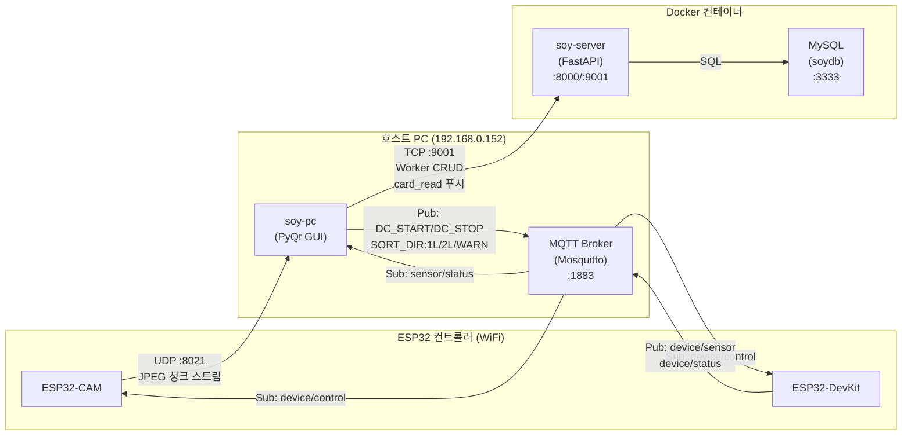
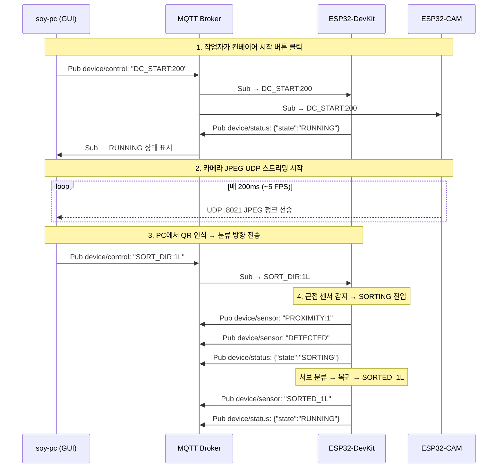

# soy-controller 통신 아키텍처

## 전체 시스템 통신 다이어그램



## 프로토콜별 상세 설명

### 1. MQTT (포트 1883) — IoT 제어/상태

> **MQTT 브로커**는 호스트 PC (`192.168.0.152`)에서 별도로 실행되는 **Mosquitto**입니다.  
> Docker Compose에는 포함되어 있지 않으며, 호스트에 직접 설치되어 있습니다.

| 방향 | 토픽 | 메시지 | 설명 |
|------|------|--------|------|
| **soy-pc → ESP32** | `device/control` | `DC_START:200` | 컨베이어 시작 (speed 0–255) |
| | | `DC_STOP` | 컨베이어 정지 |
| | | `SORT_DIR:1L` | 분류 방향: 1L 라인 |
| | | `SORT_DIR:2L` | 분류 방향: 2L 라인 |
| | | `SORT_DIR:WARN` | 미등록 QR 경고 |
| **ESP32-DevKit → soy-pc** | `device/sensor` | `PROXIMITY:1` / `PROXIMITY:0` | 근접 센서 감지/미감지 |
| | | `DETECTED` | 물체 감지 → SORTING 시작 |
| | | `SORTED_1L` / `SORTED_2L` | 분류 완료 |
| **ESP32-DevKit → soy-pc** | `device/status` | `{"state":"IDLE"}` | FSM 상태 변경 알림 |
| | | `{"state":"RUNNING"}` | |
| | | `{"state":"SORTING"}` | |
| | | `{"state":"WARNING"}` | |

#### 구독/발행 관계

```
soy-pc (paho-mqtt)
  ├── Publish  → device/control   (명령 전송)
  ├── Subscribe ← device/sensor   (센서 이벤트 수신)
  └── Subscribe ← device/status   (FSM 상태 수신)

ESP32-DevKit (PubSubClient)
  ├── Subscribe ← device/control  (명령 수신)
  ├── Publish  → device/sensor    (센서 데이터 발행)
  └── Publish  → device/status    (상태 발행)

ESP32-CAM (PubSubClient)
  └── Subscribe ← device/control  (DC_START/DC_STOP만 사용)
```

### 2. UDP (포트 8021) — 카메라 JPEG 스트리밍

> ESP32-CAM → soy-pc (단방향)

| 항목 | 값 |
|------|----|
| 프로토콜 | UDP |
| 방향 | ESP32-CAM → soy-pc |
| 포트 | 8021 |
| 전송 조건 | MQTT `DC_START` 수신 후 시작 |
| 정지 조건 | MQTT `DC_STOP` 수신 시 정지 |

#### 패킷 포맷 (IMG 청크 프로토콜)

```
Offset  Size  Field
 0-2     3    "IMG" magic
 3       1    frame_type ('S'=standard)
 4-5     2    image_id   (u16 LE, wrapping)
 6-7     2    total_chunks (u16 LE)
 8-9     2    chunk_index  (u16 LE, 0-based)
 10+    ≤1024 JPEG payload
```

- JPEG 한 프레임을 최대 1024 바이트씩 청크로 분할하여 전송
- soy-pc의 `UdpCameraThread`가 청크를 재조립하여 JPEG → QImage 변환
- QR 코드 인식도 이 스레드에서 수행 (pyzbar 라이브러리)

### 3. TCP (포트 9001) — soy-pc ↔ soy-server

> soy-server와 컨트롤러(ESP32)는 **직접 통신하지 않습니다.**  
> soy-server는 Worker CRUD, 인증, 주문 관리 등의 비즈니스 로직만 처리합니다.

| 항목 | 값 |
|------|----|
| 프로토콜 | TCP (길이 프리픽스 프레임) |
| 방향 | soy-pc ↔ soy-server (양방향) |
| 포트 | 9001 |
| 프레임 | [4바이트 BE 길이][UTF-8 JSON payload] |
| 용도 | Worker CRUD, 관리자 인증, RFID card_read 푸시 |

## 통신 흐름 요약



## 핵심 포인트

> [!IMPORTANT]
> **soy-server(FastAPI)는 ESP32 컨트롤러와 직접 통신하지 않습니다.**  
> 컨트롤러 제어는 전적으로 **soy-pc ↔ MQTT Broker ↔ ESP32** 경로로 이루어지며,  
> soy-server는 Worker 관리/인증/DB 등 비즈니스 로직만 담당합니다.

| 컴포넌트 | 역할 | 통신 수단 |
|----------|------|-----------|
| **soy-pc** | GUI + IoT 제어 허브 | MQTT (pub/sub) + UDP 수신 + TCP (서버 연결) |
| **ESP32-DevKit** | 컨베이어 FSM 실행 | MQTT (sub/pub) |
| **ESP32-CAM** | JPEG 스트리밍 | MQTT (sub) + UDP (전송) |
| **soy-server** | 비즈니스 로직 | TCP (soy-pc와만 통신) |
| **MQTT Broker** | 메시지 중계 | 호스트 PC에서 Mosquitto 실행 |
