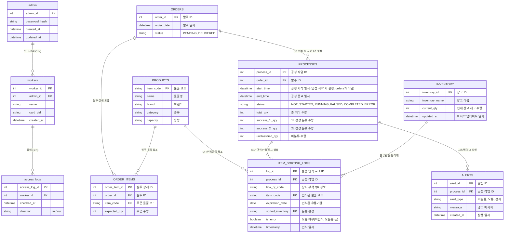

# ER Diagram — Smart Soy Sauce Factory

SYSTEM_REQUIREMENTS.md 기반 DB 스키마 개념 설계.  
- **ER 다이어그램**: 엔티티·관계 개요 (Mermaid). GitHub/GitLab, Cursor, VS Code 등에서 렌더링 가능.  
- **테이블 스키마 요약**: 실제 마이그레이션(001~004)과 일치하는 컬럼 정의. 코드/API 작성 시 이 문서와 마이그레이션을 기준으로 한다.

## 요구사항 → 테이블 매핑

| 요구 | 설명 | 사용 테이블·컬럼 |
|------|------|------------------|
| **1. 발주·입고** | 발주 등록 후 배송 완료 시 QR 인식으로 공정 생성 | `ORDERS`, `ORDER_ITEMS`, `PROCESSES` (order_id FK, QR 인식 시 process 1건 추가) |
| **2. 공정·분류** | 주문 QR 인식 시 공정 1건 생성, 상자 단위 QR 인식·분류 | `PROCESSES`, `ITEM_SORTING_LOGS` (process_id, order_id FK, item_code, sorted_inventory, is_error) |
| **3. 공정 결과·알림** | 공정 종료 시 최종 수량, 미분류/오류 등 경고 | `PROCESSES` (total_qty, success_1l_qty, success_2l_qty, unclassified_qty), `ALERTS` (process_id FK) |
| **4. 창고 재고** | 창고별 현재 재고 수량 | `INVENTORY` (inventory_name, current_qty, updated_at) |
| **5. 물품 마스터** | 물품 코드·명·브랜드·종류·용량 | `PRODUCTS` (item_code PK, name, brand, category, capacity) |

---

---

## 엔티티 요약

| 엔티티 | 요구사항 | 설명 |
|--------|----------|------|
| **admin** | S-01 | 관리자(admin_id, 비밀번호 해시) |
| **workers** | S-02, S-03 | 작업자(worker_id, 발급 관리자, 이름, 카드 UID) |
| **access_logs** | S-04 | 작업자별 출입 로그(시각, 출입 방향) |
| **PRODUCTS** | 요구 5 | 물품 마스터(item_code PK, 물품명, 브랜드, 종류, 용량) |
| **ORDERS** | 요구 1 | 발주(발주 일자, status: PENDING/DELIVERED) |
| **ORDER_ITEMS** | 요구 1 | 발주 상세(주문 물품 코드, 주문 수량) |
| **PROCESSES** | 요구 1, 2, 3 | 공정 작업(order_id FK, QR 인식 시 1건 생성, 시작/종료 일시, status, 종료 시 total_qty/success_1l_qty/success_2l_qty/unclassified_qty 갱신) |
| **ITEM_SORTING_LOGS** | 요구 2 | 상자 단위 물품 인식·분류 로그(process_id, QR, item_code, 유통기한, 분류 판정, 오류 여부) |
| **ALERTS** | 요구 3 | 시스템 알림/경고(공정 ID, 유형, 메시지) |
| **INVENTORY** | 요구 4 | 창고 재고(창고 이름, 현재 수량, 마지막 업데이트) |

---

## 테이블 스키마 요약

아래는 ER 다이어그램과 일치하는 스키마 개념 정리이다. 실제 적용 시 마이그레이션(001~004 등)과 맞춰 PK/FK/인덱스를 정의한다.

### admin
| 컬럼 | 타입 | 비고 |
|------|------|------|
| admin_id | INT UNSIGNED | PK, AUTO_INCREMENT |
| password_hash | VARCHAR(255) | NOT NULL |
| created_at | DATETIME | DEFAULT CURRENT_TIMESTAMP |
| updated_at | DATETIME | ON UPDATE CURRENT_TIMESTAMP |

### workers
| 컬럼 | 타입 | 비고 |
|------|------|------|
| worker_id | INT UNSIGNED | PK, AUTO_INCREMENT |
| admin_id | INT UNSIGNED | FK → admin, NOT NULL |
| name | VARCHAR(100) | NOT NULL |
| card_uid | VARCHAR(64) | NOT NULL, UNIQUE (RFID 카드 UID) |
| created_at | DATETIME | DEFAULT CURRENT_TIMESTAMP |

### access_logs
| 컬럼 | 타입 | 비고 |
|------|------|------|
| access_log_id | INT UNSIGNED | PK, AUTO_INCREMENT |
| worker_id | INT UNSIGNED | FK → workers, NOT NULL |
| checked_at | DATETIME | NOT NULL |
| direction | VARCHAR(10) | NOT NULL (in / out) |

### products (물품 마스터)
| 컬럼 | 타입 | 비고 |
|------|------|------|
| item_code | VARCHAR(50) | PK (물품 코드) |
| name | VARCHAR(100) | NOT NULL (물품명) |
| brand | VARCHAR(50) | NOT NULL (브랜드) |
| category | VARCHAR(50) | NULL (종류) |
| capacity | VARCHAR(30) | NULL (용량) |

### orders
| 컬럼 | 타입 | 비고 |
|------|------|------|
| order_id | INT UNSIGNED | PK, AUTO_INCREMENT |
| order_date | DATETIME | NOT NULL (발주 일자) |
| status | VARCHAR(20) | NOT NULL (PENDING, DELIVERED) |

### order_items
| 컬럼 | 타입 | 비고 |
|------|------|------|
| order_item_id | INT UNSIGNED | PK, AUTO_INCREMENT |
| order_id | INT UNSIGNED | FK → orders, NOT NULL |
| item_code | VARCHAR(50) | FK → products, NOT NULL |
| expected_qty | INT UNSIGNED | NOT NULL (주문 수량) |

### processes (공정 작업)
| 컬럼 | 타입 | 비고 |
|------|------|------|
| process_id | INT UNSIGNED | PK, AUTO_INCREMENT |
| order_id | INT UNSIGNED | FK → orders, NOT NULL (QR 인식 시 해당 발주와 연결) |
| start_time | DATETIME | NULL (공정 실제 시작 시 설정, orders 생성 시에는 미설정) |
| end_time | DATETIME | NULL |
| status | VARCHAR(20) | NOT NULL (NOT_STARTED, RUNNING, PAUSED, COMPLETED, ERROR) |
| total_qty | INT UNSIGNED | NOT NULL, DEFAULT 0 (총 처리 수량, 종료 시 갱신) |
| success_1l_qty | INT UNSIGNED | NOT NULL, DEFAULT 0 (1L 정상 분류 수량) |
| success_2l_qty | INT UNSIGNED | NOT NULL, DEFAULT 0 (2L 정상 분류 수량) |
| unclassified_qty | INT UNSIGNED | NOT NULL, DEFAULT 0 (미분류 수량) |

### item_sorting_logs (물품 인식·분류 로그)
| 컬럼 | 타입 | 비고 |
|------|------|------|
| log_id | INT UNSIGNED | PK, AUTO_INCREMENT |
| process_id | INT UNSIGNED | FK → processes, NOT NULL |
| box_qr_code | VARCHAR(255) | NULL (상자 QR 정보) |
| item_code | VARCHAR(50) | FK → products, NULL (인식된 물품 코드) |
| expiration_date | DATE | NULL (인식된 유통기한) |
| sorted_inventory | VARCHAR(50) | NULL (분류 판정, 창고/인벤토리 참조) |
| is_error | TINYINT(1) | NOT NULL, DEFAULT 0 (미인식·오분류 등) |
| timestamp | DATETIME | NOT NULL (인식 일시) |

### alerts (시스템 알림/경고)
| 컬럼 | 타입 | 비고 |
|------|------|------|
| alert_id | INT UNSIGNED | PK, AUTO_INCREMENT |
| process_id | INT UNSIGNED | FK → processes, NOT NULL |
| alert_type | VARCHAR(50) | NOT NULL (미분류, 오류, 정지 등) |
| message | TEXT | NULL (경고 메시지) |
| created_at | DATETIME | DEFAULT CURRENT_TIMESTAMP |

### inventory (창고 재고)
| 컬럼 | 타입 | 비고 |
|------|------|------|
| inventory_id | INT UNSIGNED | PK, AUTO_INCREMENT |
| inventory_name | VARCHAR(100) | NOT NULL (창고 이름) |
| current_qty | INT UNSIGNED | NOT NULL, DEFAULT 0 |
| updated_at | DATETIME | ON UPDATE CURRENT_TIMESTAMP |
