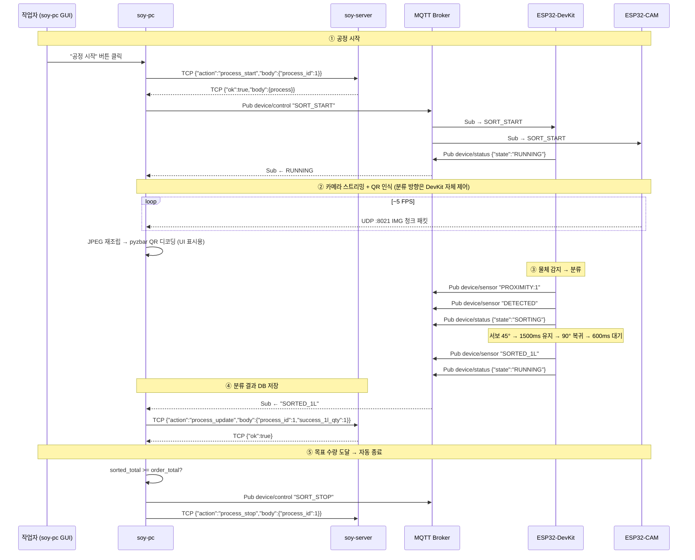

# SoyFactory 프로토콜 명세서

> **문서 기준**: 현재 구현된 코드 (`main` 브랜치) 기준  
> **최종 갱신**: 2026-03-04

---

## 1. 시스템 구성 요소

| 컴포넌트 | 역할 | 네트워크 |
|----------|------|----------|
| **ESP32-DevKit** | 컨베이어 FSM (DC모터·서보·LED·센서) | WiFi STA |
| **ESP32-CAM** | JPEG 카메라 스트리밍 | WiFi STA |
| **soy-pc** | PyQt GUI + IoT 제어 허브 | 호스트 네트워크 |
| **MQTT Broker** | Mosquitto (호스트 PC 직접 실행) | `192.168.0.152:1883` |
| **soy-server** | FastAPI (Docker) — 비즈니스 로직 | `:8000` (HTTP), `:9001` (TCP) |
| **MySQL** | soydb (Docker) | `:3333` |

---

## 2. MQTT 프로토콜 (포트 1883)

### 2.1 연결 정보

| 항목 | 값 |
|------|----|
| 브로커 | `192.168.0.152:1883` (Mosquitto) |
| QoS | 0 (At Most Once) |
| Clean Session | true |
| Client ID | `SoyDevKit-{random_hex}` / `SoyCam-{random_hex}` / `soy-pc` |

### 2.2 토픽 & 메시지 정의

#### 토픽: `device/control` (soy-pc → ESP32)

| 메시지 | 포맷 | 설명 | 처리 주체 |
|--------|------|------|-----------|
| `SORT_START` | 문자열 | 분류 시작 (DC·카메라 구동) | DevKit + CAM |
| `SORT_STOP` | 문자열 | 분류 종료 (DC·카메라 정지) | DevKit + CAM |
| `SORT_PAUSE` | 문자열 | 일시정지 (DC brake, 카메라 유지) | DevKit |
| `SORT_RESUME` | 문자열 | 일시정지 해제 (DC 재구동) | DevKit |
| `SORT_DIR:{방향}` | 문자열 | 분류 방향 지시 (`1L` / `2L` / `WARN`) | DevKit |

> **발행 시점 (soy-pc):**
> - `SORT_START` — 작업자가 "시작" 버튼 클릭 시
> - `SORT_PAUSE` — 작업자가 "일시정지" 버튼 클릭 시
> - `SORT_RESUME` — 작업자가 "재개" 버튼 클릭 시 (일시정지 → 재개)
> - `SORT_STOP` — 작업자가 "중지" 버튼 클릭 시, 또는 공정 자동 완료 시
> - `SORT_DIR:{방향}` — ESP32 S1/S2 센서에서 `DETECTED` 수신 시, QR Queue에서 방향을 꺼내 발행

#### 토픽: `device/sensor` (ESP32-DevKit → soy-pc)

| 메시지 | 포맷 | 설명 |
|--------|------|------|
| `PROXIMITY:1` | 문자열 | 근접 센서 감지 (상태 변경 시만 발행) |
| `PROXIMITY:0` | 문자열 | 근접 센서 미감지 (상태 변경 시만 발행) |
| `DETECTED` | 문자열 | 물체 감지 → SORTING 진입 시 |
| `SORTED_1L` | 문자열 | 1L 분류 완료 |
| `SORTED_2L` | 문자열 | 2L 분류 완료 |
| `SORTED_UNCLASSIFIED` | 문자열 | 미분류 완료 (sort_dir=NONE일 때) |

> **soy-pc 수신 처리:**
> - `PROXIMITY:*` → GUI 근접센서 상태 표시 갱신
> - `SORTED_1L` → DB `process.success_1l_qty += 1` 업데이트 (TCP → soy-server)
> - `SORTED_2L` → DB `process.success_2l_qty += 1` 업데이트
> - `SORTED_UNCLASSIFIED` → DB `process.unclassified_qty += 1` 업데이트
> - 분류 합계가 주문 수량에 도달하면 자동으로 `SORT_STOP` 발행 + 공정 종료

#### 토픽: `device/status` (ESP32-DevKit → soy-pc)

| 메시지 | 포맷 | 설명 |
|--------|------|------|
| `{"state":"IDLE"}` | JSON | 대기 상태 |
| `{"state":"RUNNING"}` | JSON | 공정 진행 중 |
| `{"state":"SORTING"}` | JSON | 분류 동작 중 |
| `{"state":"WARNING"}` | JSON | 미등록 QR 경고 중 |
| `{"state":"PAUSED"}` | JSON | 일시정지 상태 |

> **soy-pc 수신 처리:**
> - FSM 상태 표시 UI 업데이트 (컬러 배지)
> - Watchdog: ESP32가 `IDLE`인데 soy-pc에서 공정이 진행 중이면 `SORT_START` 재전송
> - **단, `PAUSED` 상태에서는 Watchdog 비활성화** (의도적 일시정지이므로 재전송 불필요)

### 2.3 구독/발행 맵

```
┌──────────────────────────────────────────────────────────────────┐
│ soy-pc (paho-mqtt, Client ID: "soy-pc")                          │
│   Pub  → device/control  (SORT_START / SORT_STOP /               │
│                            SORT_PAUSE / SORT_RESUME /            │
│                            SORT_DIR:{1L|2L|WARN})                │
│   Sub  ← device/sensor                                           │
│   Sub  ← device/status                                           │
├──────────────────────────────────────────────────────────────────┤
│ ESP32-DevKit (PubSubClient, ID: "SoyDevKit-xxxx")                │
│   Sub  ← device/control                                          │
│   Pub  → device/sensor   (PROXIMITY:* / DETECTED /               │
│                            SORTED_1L / SORTED_2L /               │
│                            SORTED_UNCLASSIFIED)                  │
│   Pub  → device/status   (IDLE / RUNNING / SORTING /             │
│                            PAUSED / WARNING)                     │
├──────────────────────────────────────────────────────────────────┤
│ ESP32-CAM (PubSubClient, ID: "SoyCam-xxxx")                      │
│   Sub  ← device/control  (SORT_START → UDP ON, SORT_STOP → OFF)  │
└──────────────────────────────────────────────────────────────────┘
```

---

## 3. UDP 프로토콜 (포트 8021)

### 3.1 연결 정보

| 항목 | 값 |
|------|----|
| 방향 | ESP32-CAM → soy-pc (단방향) |
| 포트 | 8021 |
| 전송 조건 | MQTT `SORT_START` 수신 후 시작 |
| 정지 조건 | MQTT `SORT_STOP` 수신 시 정지 |
| 프레임 레이트 | ~5 FPS (200ms 인터벌) |
| JPEG 해상도 | QVGA (320×240) |
| JPEG 품질 | 12 (0–63, 낮을수록 고품질) |

### 3.2 IMG 패킷 포맷

하나의 JPEG 프레임을 최대 1024바이트 청크로 분할하여 전송한다.

```
┌───────────────────────────────────────────────┐
│ Offset │ Size │ Type    │ Field               │
├────────┼──────┼─────────┼─────────────────────┤
│  0–2   │  3B  │ ASCII   │ "IMG" (매직 바이트)  │
│  3     │  1B  │ char    │ frame_type ('S')     │
│  4–5   │  2B  │ u16 LE  │ image_id (0~65535)   │
│  6–7   │  2B  │ u16 LE  │ total_chunks         │
│  8–9   │  2B  │ u16 LE  │ chunk_index (0-based)│
│ 10+    │ ≤1024│ bytes   │ JPEG payload         │
└───────────────────────────────────────────────┘
```

| 필드 | 설명 |
|------|------|
| `"IMG"` | 3바이트 매직. 이 값이 아니면 패킷 폐기 |
| `frame_type` | `'S'` = Standard. 향후 확장용 |
| `image_id` | 프레임 고유 ID. 0→65535 순환 (wrapping) |
| `total_chunks` | 이 프레임의 전체 청크 수 |
| `chunk_index` | 현재 청크 인덱스 (0부터) |
| JPEG payload | 최대 1024바이트의 JPEG 바이너리 조각 |

### 3.3 수신 측 재조립 로직 (soy-pc)

```python
# 1. 패킷 검증: len >= 10 and data[:3] == b"IMG"
# 2. 헤더 파싱: struct.unpack_from("<H", data, 4/6/8)
# 3. 버퍼에 저장: buffers[image_id]["chunks"][chunk_index] = data[10:]
# 4. 모든 청크 수신 완료 시:
#    jpeg_data = b"".join(chunks[0], chunks[1], ..., chunks[N-1])
# 5. cv2.imdecode(jpeg_data) → QImage → GUI 표시
# 6. pyzbar.decode(frame) → QR 코드 인식
# 7. 이전 이미지 버퍼는 최대 2개 유지 (메모리 관리)
```

### 3.4 전송 실패 처리

- 청크 전송 실패 (ESP32 `endPacket() == false`): 30ms 대기 후 다음 청크로 진행
- 전송 성공: 15ms 인터-청크 딜레이
- soy-pc 측에서 불완전 프레임은 자동 폐기 (전체 청크 미수신)

---

## 4. TCP 프로토콜 (포트 9001)

### 4.1 연결 정보

| 항목 | 값 |
|------|----|
| 방향 | soy-pc ↔ soy-server (양방향) |
| 포트 | 9001 |
| 프레임 | 길이 프리픽스 방식 |
| 인코딩 | UTF-8 JSON |
| 최대 페이로드 | 1MB (1,048,576 bytes) |
| 타임아웃 | 10초 (soy-pc 측) |

### 4.2 프레임 포맷

```
┌─────────────────────────────────────────┐
│ Offset │ Size  │ Type       │ Field     │
├────────┼───────┼────────────┼───────────┤
│  0–3   │  4B   │ u32 BE     │ payload   │
│        │       │            │ 길이(byte)│
│  4+    │ N     │ UTF-8 JSON │ payload   │
└─────────────────────────────────────────┘
```

### 4.3 요청 메시지 (soy-pc → soy-server)

```json
{
  "type": "request",
  "id": 1,
  "action": "list_orders",
  "body": { ... }
}
```

| 필드 | 타입 | 설명 |
|------|------|------|
| `type` | string | 항상 `"request"` |
| `id` | int | 요청 고유 ID (자동 증가, 응답 매칭용) |
| `action` | string | 액션 이름 (아래 액션 목록 참조) |
| `body` | object | 액션별 파라미터 |

### 4.4 응답 메시지 (soy-server → soy-pc)

```json
{
  "type": "response",
  "id": 1,
  "ok": true,
  "body": { ... },
  "error": null
}
```

| 필드 | 타입 | 설명 |
|------|------|------|
| `type` | string | 항상 `"response"` |
| `id` | int | 요청 `id`와 동일 (매칭용) |
| `ok` | bool | 성공 여부 |
| `body` | any | 성공 시 응답 데이터, 실패 시 `null` |
| `error` | string\|null | 실패 시 에러 메시지, 성공 시 `null` |

### 4.5 서버 푸시 메시지 (soy-server → soy-pc, 비동기)

#### card_read (RFID 카드 인식)

시리얼 포트에서 RFID 카드 인식 시, 연결된 모든 soy-pc 클라이언트에 브로드캐스트.

```json
{
  "type": "card_read",
  "uid": "A1B2C3D4"
}
```

## 4.6 액션 목록

### 인증 불필요 액션

| Action | Body | Success Body | 설명 |
|--------|------|--------------|------|
| `admin_count` | – | `{count}` | 관리자 수 |
| `first_admin_needs_password` | – | `{needs_password}` | 최초 비밀번호 필요 여부 |
| `register_first_admin` | `password` | `null` | 최초 관리자 등록 |
| `admin_login` | `password` | `{token, admin_id}` | 로그인 |
| `admin_logout` | `auth_token` | `null` | 로그아웃 |
| `list_orders` | – | `[order]` | 주문 목록 |
| `get_order` | `order_id` | `{order}` | 주문 상세 |
| `get_order_id_by_order_item_id` | `order_item_id` | `{order_id}` | 품목 → 주문 |
| `order_mark_delivered` | `order_id` \| `order_item_id` | `{order_id, process_id}` | 입고 처리 |
| `list_processes` | – | `[process]` | 공정 목록 |
| `process_start` | `process_id` | `{process}` | 공정 시작 |
| `process_stop` | `process_id` | `{process}` | 공정 종료 |
| `process_update` | `process_id, success_1l_qty?, success_2l_qty?, unclassified_qty?` | `{process}` | 수량 갱신 |

---

### 관리자 로그인 필수 액션

| Action | Body | Success Body | 설명 |
|--------|------|--------------|------|
| `get_first_admin_id` | `auth_token` | `{admin_id}` | 최초 관리자 ID |
| `list_workers` | `auth_token` | `[worker]` | 작업자 목록 |
| `create_worker` | `auth_token, admin_id, name, card_uid` | `{worker}` | 작업자 등록 |
| `update_worker` | `auth_token, worker_id, name?, card_uid?` | `{worker}` | 작업자 수정 |
| `delete_worker` | `auth_token, worker_id` | `null` | 작업자 삭제 |

---

## 5. 전체 워크플로우 시퀀스

### 5.1 분류 공정 전체 흐름



### 5.2 미등록/경고 처리 (ESP32-DevKit 자체)

분류 방향 및 경고(WARNING) 상태는 soy-pc가 MQTT로 보내지 않으며, ESP32-DevKit이 센서·내부 로직으로 처리한다.  
(필요 시 TCP 등 별도 경로로 방향 지시를 확장할 수 있음.)

---

## 6. 포트 요약

| 포트 | 프로토콜 | 컴포넌트 | 방향 | 설명 |
|------|---------|----------|------|------|
| **1883** | MQTT | Mosquitto (호스트) | 양방향 | IoT 제어·상태·센서 |
| **8021** | UDP | ESP32-CAM → soy-pc | 단방향 | JPEG 청크 스트리밍 |
| **9001** | TCP | soy-pc ↔ soy-server | 양방향 | Worker CRUD, 공정 관리, card_read |
| **8000** | HTTP | soy-server (Docker) | 양방향 | Health check, API docs |
| **3333** | MySQL | MySQL (Docker) | 양방향 | DB 접근 (내부용) |
| **8080** | HTTP | Adminer (Docker) | 양방향 | DB 관리 웹 UI |

---

## 7. 환경 변수 (.env)

### soy-controller/.env (ESP32 빌드 시 주입)

| 변수 | 예시 값 | 용도 |
|------|---------|------|
| `WIFI_SSID` | `addinedu_201class_4-2.4G` | WiFi SSID |
| `WIFI_PASS` | `201class4!` | WiFi 비밀번호 |
| `MQTT_BROKER` | `192.168.0.152` | MQTT 브로커 IP |
| `UDP_IP` | `192.168.0.152` | UDP 스트리밍 대상 IP |

### soy-pc 환경 변수

| 변수 | 기본값 | 용도 |
|------|--------|------|
| `MQTT_BROKER_HOST` | `127.0.0.1` | MQTT 브로커 호스트 |
| `MQTT_BROKER_PORT` | `1883` | MQTT 브로커 포트 |
| `SOY_SERVER_HOST` | `127.0.0.1` | soy-server TCP 호스트 |
| `SOY_SERVER_TCP_PORT` | `9001` | soy-server TCP 포트 |

### docker-compose 환경 변수

| 변수 | 기본값 | 용도 |
|------|--------|------|
| `SERIAL_DEVICE` | (미설정) | RFID 시리얼 장치 (`/dev/ttyUSB0`) |
| `MYSQL_*` | `soy/soy/soydb` | DB 접속 정보 |
| `SOY_PC_TCP_PORT` | `9001` | TCP 브릿지 포트 |
